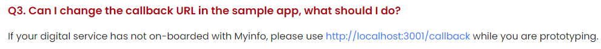

# SendSecure Documentation
1. [User Documentation](https://github.com/chshen1998/ndi-tap/wiki/User-Documentation)
    1. [Background](https://github.com/chshen1998/ndi-tap/wiki/User-Documentation#background)
    2. [Problem Solution](https://github.com/chshen1998/send-secure-ndi-tap/wiki/User-Documentation#problem-solution)
    3. [Use Cases](https://github.com/chshen1998/ndi-tap/wiki/User-Documentation#use-cases)
    4. [User Experience Diagram](https://github.com/chshen1998/ndi-tap/wiki/User-Documentation#user-experience-diagram)
    5. [Demo Video](https://github.com/chshen1998/ndi-tap/wiki/User-Documentation#demo-video)
2. [Technical Documentation](https://github.com/chshen1998/ndi-tap/wiki/Technical-Documentation)
    1. [Architecture Overview](https://github.com/chshen1998/send-secure-ndi-tap/wiki/Technical-Documentation#architecture-overview)
    2. [Client & Server Sockets](https://github.com/chshen1998/send-secure-ndi-tap/wiki/Technical-Documentation#client--server-sockets)
    3. [Database & Caching](https://github.com/chshen1998/send-secure-ndi-tap/wiki/Technical-Documentation#database--caching)
    4. [Cloud Hosting](https://github.com/chshen1998/send-secure-ndi-tap/wiki/Technical-Documentation#cloud-hosting)

## Demo Video
YouTube link: https://youtu.be/L0J9PzdZ3a8 

SendSecure link: https://main.d16toymsnxyjhr.amplifyapp.com/

**IMPORTANT: However, due to the fact that this application is not on-boarded with MyInfo, `http://localhost:3001/callback` is required to be set as the callback url when using authentication with Singpass. As a result, the Authentication with Singpass cannot work when the frontend hosted on AWS Amplify. To see full working demo of SendSecure, please view the YouTube link.

